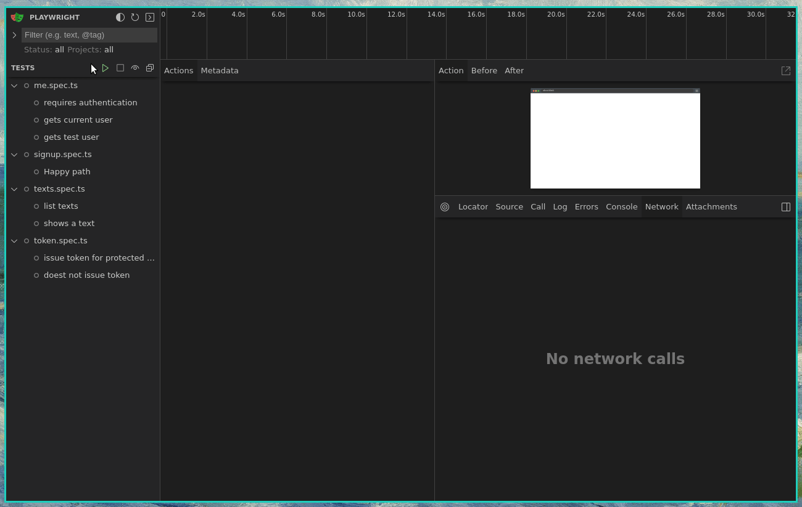

# HidroponiQA

[](http://neni.dev/emojicom)

Testes automatizados do [Hidroponica](https://github.com/nenitf/hidroponica). Todos os testes necessitam do sistema sendo executado localmente em ambiente *local*/*staging* com o *seeder* padrão.



## Utilização

- `npm start` desenvolvimento/debug dos testes 
- `npm test` utilização dos testes para validar o sistema
- `npm run update-snapshots` atualização de snapshots para os testes de regressão visual

### Linting

```sh
npm run format
```
